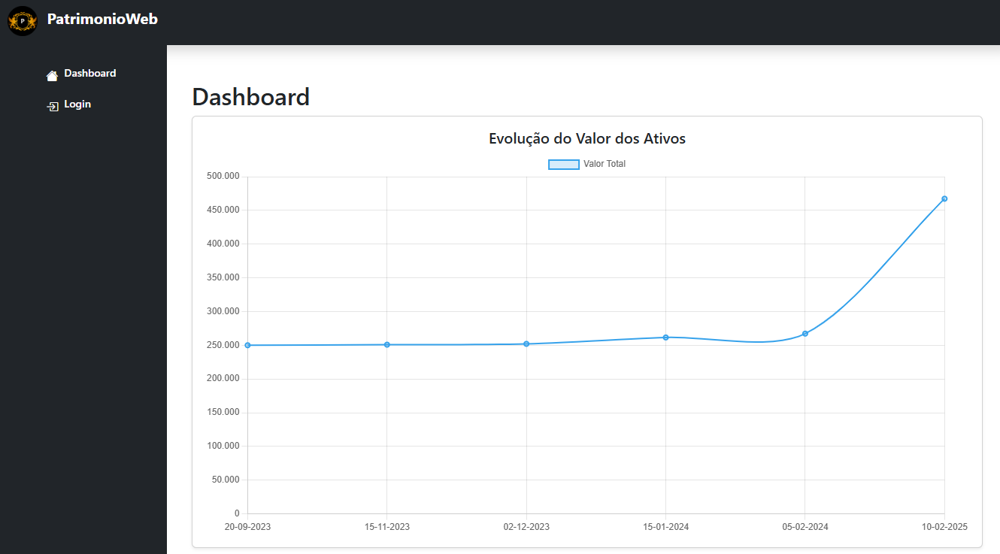
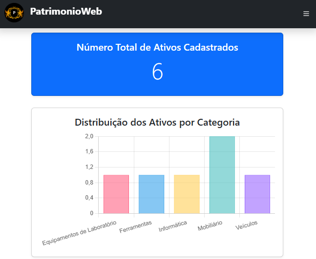
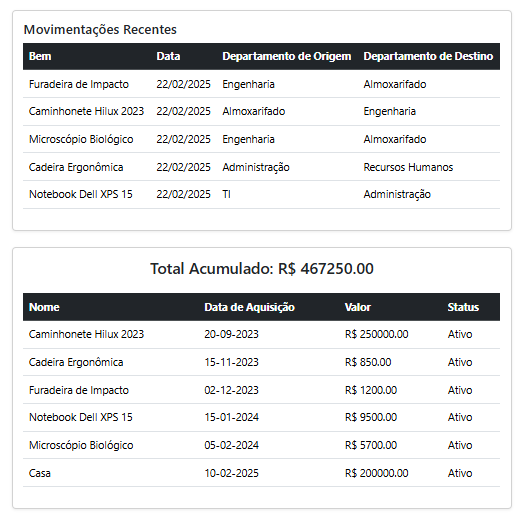
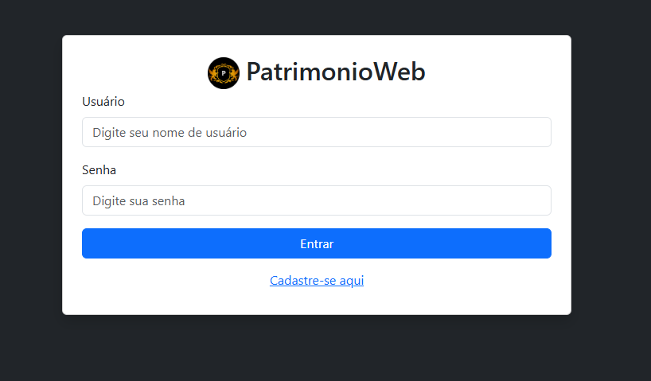
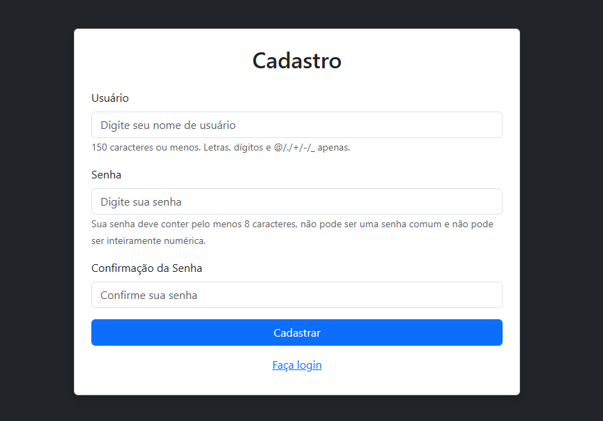
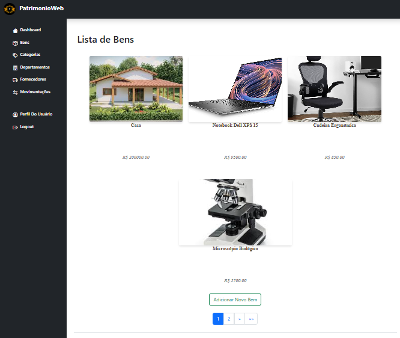
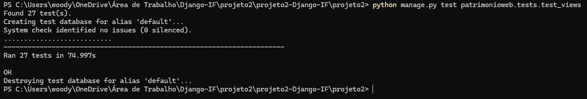
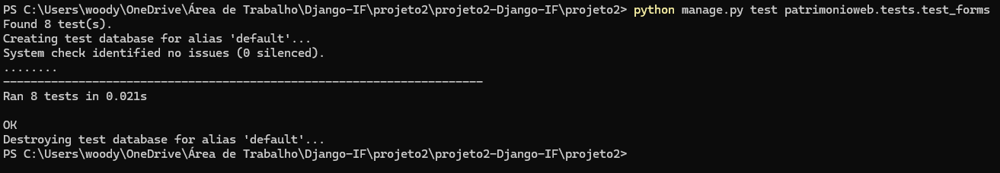
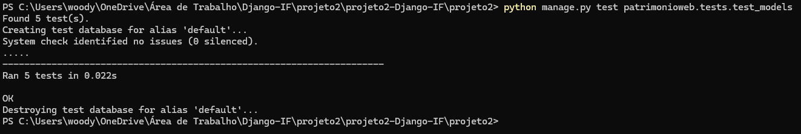

# projeto2-Django-IF
 # PatrimonioWeb

Este repositório contém o **Projeto 2** do curso **FIC - Desenvolvimento Web com o Framework Django**, oferecido pelo **Instituto Federal do Sertão Pernambucano**. O objetivo do curso é ensinar os fundamentos do desenvolvimento web utilizando o framework Django.

---

## 📚 Sobre o Projeto

O **PatrimonioWeb** é uma aplicação web desenvolvida para a **gestão de patrimônio**. O projeto permite o controle eficiente de bens, categorias, departamentos, fornecedores e movimentações, consolidando os conceitos aprendidos durante o curso.

### 🚀 Funcionalidades


- **Dashboard**(Acesso inicial sem login):
  - Evolução do Valor dos Ativos.
      

  - Número Total de Ativos Cadastrados, e Distribuição dos Ativos por Categoria.
    

  - Movimentações Recentes, e Dados Detalhados dos Ativos.
      

- **Autenticação de Usuários**:
  - Tela de login para acesso autenticado ao sistema.
      

  - Cadastro de usuários.
      
  
- **Gestão de Bens**:
  - Listagem, cadastro, edição e remoção de bens patrimoniais.
       

- **Gestão de Categorias**:
  - Organização dos bens em categorias específicas.

- **Gestão de Departamentos**:
  - Controle de setores responsáveis pelos bens.

- **Gestão de Fornecedores**:
  - Cadastro e controle de fornecedores dos bens patrimoniais.

- **Controle de Movimentações**:
  - Registro de transferências de bens entre departamentos.

- **Barra de Navegação**:
  - Acesso rápido a todas as funcionalidades do sistema.

---

## 🛠️ Tecnologias Utilizadas

- **Linguagem de Programação**: Python
- **Framework Web**: Django
- **Banco de Dados**: SQLite (padrão do Django)
- **Frontend**:
  - HTML5
  - CSS3
  - Bootstrap 5

---

## 🧪 Testes

A aplicação possui um conjunto de testes automatizados para garantir a funcionalidade correta das views, formulários e modelos. Os testes estão organizados nos seguintes arquivos:

### 📌 test_views.py

- **Autenticação de Usuários**
  - `test_login_view`
  - `test_logout_view`
  - `test_perfil_usuario_view`
- **Dashboard**
  - `test_dashboard_bens_view`
- **Bens**
  - `test_bens_list_view`
  - `test_bens_detail_view`
  - `test_bens_create_view`
  - `test_bens_update_view`
  - `test_bens_delete_view`
- **Categorias**
  - `test_categorias_list_view`
  - `test_categorias_create_view`
  - `test_categorias_update_view`
  - `test_categorias_delete_view`
- **Departamentos**
  - `test_departamentos_list_view`
  - `test_departamentos_create_view`
  - `test_departamentos_update_view`
  - `test_departamentos_delete_view`
- **Fornecedores**
  - `test_fornecedores_list_view`
  - `test_fornecedores_detail_view`
  - `test_fornecedores_create_view`
  - `test_fornecedores_update_view`
  - `test_fornecedores_delete_view`
- **Movimentações**
  - `test_movimentacoes_list_view`
  - `test_movimentacoes_detail_view`
  - `test_movimentacoes_create_view`
  - `test_movimentacoes_update_view`
  - `test_movimentacoes_delete_view`



### 📌 test_forms.py

- **Categorias**
  - `test_categoria_form_valid_data`
  - `test_categoria_form_invalid_data`
- **Departamentos**
  - `test_departamento_form_valid_data`
  - `test_departamento_form_invalid_data`
- **Fornecedores**
  - `test_fornecedor_form_valid_data`
  - `test_fornecedor_form_invalid_data`
- **Bens**
  - `test_bem_form_valid_data`
  - `test_bem_form_invalid_data`



### 📌 test_models.py

- **Categorias**
  - `test_nome_deve_ser_unico`
- **Departamentos**
  - `test_nome_deve_ser_unico`
- **Fornecedores**
  - `test_nome_deve_ser_unico`
- **Bens**
  - `test_codigo_rfid_deve_ser_unico`
- **Movimentações**
  - `test_movimentacao_deve_atualizar_situacao_do_bem`



Para rodar os testes, utilize o seguinte comando:

```sh
python manage.py test patrimonio.tests.test_views
python manage.py test patrimonio.tests.test_forms
python manage.py test patrimonio.tests.test_models
```

---

Este projeto foi desenvolvido como parte do curso **FIC - Desenvolvimento Web com o Framework Django** no **Instituto Federal do Sertão Pernambucano**.


